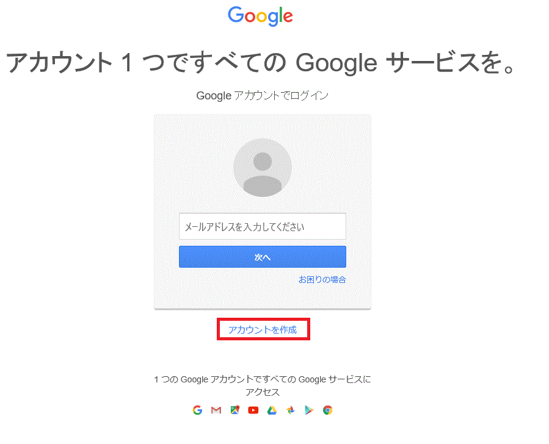

# 概要
GoogleDriveに格納したスプレットシートからJson形式で情報を取得し、
サイトをある程度動的に生成する

---

# 前提条件

* 以下のファイルはサーバーにアップロードする必要はありません

|名称|内容|
|:--|:--|
|README.md|手順説明用ファイル|
|readmeImg|このフォルダの配下は手順説明用の画像です|

## 手順1:最新のソースを取得

1. 「Clone or download（赤枠部分）」をクリック
1. 表示される「Download Zip（緑枠部分）」をクリックし、ホームページのソースを取得
1. デスクトップに解凍する


## 手順2：Googleアカウントを取得する

1. 画面右上のログインボタンを押下する

1. 画面中程にある「アカウントを作成」リンクを押下する

1． 画面の指示に従ってアカウントを取得する

---

## 手順3：Googleドライブにデータを作成する
1. ブラウザで[Google](https://www.google.co.jp/)にアクセスする
1. 画面右上のボタン（赤枠部分）を押下、表示されるメニューから「ドライブ（緑枠）」を押下する

1. 画面左上「新規（赤枠部分）」をクリック、「Googleスプレッドシート（緑枠部分）」をクリック

1. 以下の例を参考に入力


|1列目|2列目|3列目|
|:--|:--|:--|
|menuname|menuurl|img|
|トップ|top.html|top.jpg|
|教会の案内|about.html|about.jpg|
|教会の歴史|history.html|history.jpg|
|教会の信仰|faith.html||
|集会案内|aboutmeeting.html||
|教会学校|school.html||
|教会の様子|watch.html||
|青年会|youngman.html||
|説教を聞く|listen.html||
|牧師紹介|pastor.html||
|教会の地図|map.html||
|リンク|link.html|　|

__内容の説明__  
1行目は必ず表のとおり、以下の内容にしてください  
menuname, menuurl, img  
各列に記載する内容は以下の通りです

|列名|内容|備考|
|:--|:--|:--|
|menuname|ホームページ上部に表示するメニューの名前です。||
|menuurl|対応するメニューを押したときに表示するファイルです|pagesフォルダ配下にあるファイルを指定してください。pagesフォルダ配下にフォルダを配置した場合は、フォルダとファイルの間を"/"で区切ってください|
|img|対応するページが表示されているを表示した場合に背景に表示する画像ファイルをです|img配下にあるファイルを指定してください。imgフォルダ配下にフォルダを配置した場合は、フォルダとファイルの間を"/"で区切ってください|

※ページを減らす場合は行を削除、追加する場合は行を追加してください。

---

## 手順4：Googleドライブのデータとホームページのメニューをリンクさせる
1. 画面上部の「ファイル（赤枠部分）」をクリック、表示されるメニューの「ウェブに公開（緑枠部分）」をクリック

1. 赤枠部分が「ドキュメント全体」「ウェブページ」となっていることを確認して、「公開（緑枠部分）」をクリック

1. ポップアップには「はい」を選択。
1. 以下の画面が表示されるので、赤枠ぶぶのURLをコピーしてメモ帳に貼り付けてください。

1. 赤枠の部分をコピーしてください（"d/"と"/pubhtml"の間。この場合は"1BQ0EntWLi96MoOzzwps6CI1ieagW-9aWUoSK1cvtctI"）

1. デスクトップに解凍したホームページ内の、propフォルダの中にある「p.js」をメモ帳で開く
1. ""の中をコピーした文字列に書き換える
1. ファイルを保存する

以上で設定は完了です。  
自分のパソコンで表示を確認する場合はセキュリティの関係上「InternetExplorer」か「Firefox」で確認してください。  
「Google Chrome」で確認したい場合は[ここら辺](http://qiita.com/cigalecigales/items/33afaa42f91542ffa62e)を参考にしてください。

---

## ホームページをカスタマイズする
### 前提条件
このホームページは修正する範囲を最小限にしてなるべくホームページを壊さない作りになっています。  
以下の物以外はなるべく触らないでください。

* Googleスプレッドシートで作ったファイル
* pagesフォルダの配下にあるファイル
* imgフォルダの配下にあるファイル

### 背景の変更
スプレッドシートで指定するページ単位の背景画像とは別に、全体の背景画像がimgフォルダ配下の「bg.png」で指定されていますので、これを変更すればタイル表示が変わります。  

### ページ内で音楽を再生する
以下のタグを埋め込んでください
```
<audio src="./【ファイル名】" controls>
この文字列が表示されている場合、お使いのブラウザはaudioタグをサポートしていません。<br />
<a href="./【ファイル名】">こちら</a>より音声ファイルをダウンロードしてご利用ください。
</audio>
```
